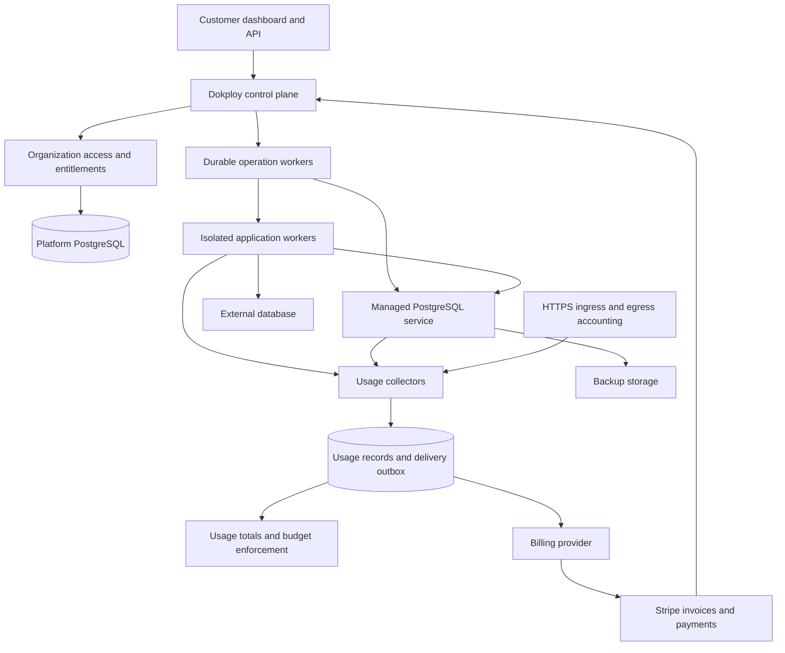

# Public hosted platform: architecture and delivery plan

Reuse audit, 2026-09-20: [capability map and implementation references](hosted-platform-reuse-audit.md). Licensing review is deferred to the product launch decision or funding review under the user's later instruction; technical reuse selection can proceed. The existing feature descriptions below are retained.

Research date: 2026-09-19. Implementation reference: Beads epic `DOK-9q8` (phases A-H); later design reference: `DOK-0xv` (phase I).

This document specifies proposed behavior. It does not report implementation or release readiness. Beads stores assignments, dependencies, work notes, and completion. Start implementation with `bd prime`, `bd ready`, and `bd show <id>`.

## 1. Requirements and planning assumptions

The user requires:

- Public self-service signup from the first paid release.
- Multiple tenants, usage tracking, and payment for use.
- Application hosting, with Vercel as a feature reference.
- An integrated database offer that covers common PostgreSQL use cases, with Neon as a feature reference.
- Support for Neon and other external or customer-managed databases.
- A managed database provider only when its cost is equal to or lower than our own infrastructure on Azure or a similar service.

Recommended first release: regional application hosting plus managed PostgreSQL, organization billing, usage reports, and enforced resource limits. Use the existing Dokploy control plane, with separate workers for customer workloads. Offer a single paid plan and a bounded trial. Add further plans only when measured costs and customer requirements support them.

The plan assumes one initial region and one currency. Azure Sweden Central is the cost example because the root README describes a test deployment there. It is not a production region decision. Team capacity, launch date, workload distribution, margin, and selling prices have not been supplied. Phase A sets these inputs before price publication or infrastructure purchase.

Here, a tenant is a customer organization. The users of an application hosted by that organization are a separate concern. This platform does not impose a tenancy model on customer application tables.

## 2. Vercel and Neon feature references

These are product behavior references, not claims that this repository implements the same infrastructure. Recheck vendor terms and prices before procurement.

| Capability | Vercel reference | Neon reference | Proposed service |
| --- | --- | --- | --- |
| Customer boundary | Teams contain projects and memberships. [Accounts](https://vercel.com/docs/accounts) | Organizations contain projects, access, and billing. [Organizations](https://neon.com/docs/manage/organizations) | Reuse `organization`; one billing account per organization. |
| Application delivery | Git deployment, regional functions, and CDN are distinct features. [Regions](https://vercel.com/docs/functions/configuring-functions/region), [CDN](https://vercel.com/docs/cdn) | Database projects have a selected region. [Regions](https://neon.com/docs/introduction/regions) | Git or image deployment, HTTPS, logs, workers, schedules, and region selection. Put the application near its database. |
| Usage visibility | Team usage can be examined by project and region. [Usage](https://vercel.com/docs/pricing/manage-and-optimize-usage) | Consumption APIs expose project usage. [Platforms](https://neon.com/platforms) | Organization totals with project, environment, resource, and region detail. Show freshness and estimated charges. |
| Compute charges | Fluid compute distinguishes active CPU, provisioned memory, and invocations. [Compute pricing](https://vercel.com/docs/functions/usage-and-pricing) | Database compute uses CU-hours; storage has separate charges. [Plans](https://neon.com/docs/introduction/plans) | Initially charge allocated application capacity over time and database size over time. Do not describe this as active-CPU or serverless billing. |
| Spending controls | Spend Management can notify or pause projects. It excludes some fixed and integration charges and has a checking delay. [Spend Management](https://vercel.com/docs/spend-management) | Project resource limits are available for embedded database services. [Platform API](https://neon.com/blog/provision-postgres-neon-api) | Enforce resource quotas before allocation; provide a variable-use budget and pause policy. Explain retained storage charges. |
| Integrated database | New PostgreSQL databases use Marketplace providers; credentials can be added to project environments. [Postgres](https://vercel.com/docs/postgres) | Provides PostgreSQL connections, compute management, and pooling. [Pooling](https://neon.com/docs/connect/connection-pooling) | Create PostgreSQL in the project, then attach scoped connection secrets to an application. |
| Environments and recovery | Deployment environments and preview deployments separate application versions. [Environments](https://vercel.com/docs/deployments/environments) | Branching and restore are built into the database architecture. [Branching](https://neon.com/docs/introduction/branching) | Separate development and production databases. Restore to a new database. Add optional full-copy preview databases after launch. |
| Idle databases | Function execution can stop between requests. [Compute pricing](https://vercel.com/docs/functions/usage-and-pricing) | Compute can suspend independently of durable storage. [Scale to zero](https://neon.com/blog/why-you-want-a-database-that-scales-to-zero) | First release uses fixed database sizes and explicit stop/start. Automatic wake on connection is a later feature. |
| External services | Marketplace can connect other database providers. [Postgres](https://vercel.com/docs/postgres) | Platforms can embed Neon without a separate end-user account. [Platforms](https://neon.com/platforms) | Accept standard external connection strings. An embedded provider remains conditional on the cost gate. |

The first release covers web applications, APIs, ordinary relational data, background workers, and scheduled jobs. It does not include a replacement for customer application authentication, a public object-storage product, or every Vercel and Neon feature. Applications can use external services through scoped secrets.

## 3. Repository baseline

The following findings come from source inspection. They are not a complete security audit or a live deployment check.

| Existing implementation | Evidence | Required change |
| --- | --- | --- |
| Organizations, memberships, invitations, and project ownership | `packages/server/src/db/schema/account.ts`, `project.ts`; `apps/dokploy/server/api/routers/organization.ts` | Keep these identities. Add consistent resource ownership checks, billing roles, and tenant lifecycle. |
| Better Auth, permission checks, organization session context | `packages/server/src/lib/auth.ts`, `services/permission.ts`; `apps/dokploy/server/api/trpc.ts` | Verify each request, API key, job, WebSocket, and resource reference against the organization. |
| Stripe customers and subscriptions on users; prices use server quantity | `packages/server/src/db/schema/user.ts`; `apps/dokploy/server/utils/billing.ts`, `stripe.ts`; `pages/api/stripe/webhook.ts` | Introduce organization billing and resource meters. Separate legacy subscriptions from the new product. |
| Plan limits with an unlimited legacy fallback | `apps/dokploy/server/api/utils/plan-limits.ts` | Unknown managed-hosting entitlement must deny new allocation. Enforce limits in transactions. Preserve explicit self-hosted behavior. |
| PostgreSQL containers, volumes, external ports, resource settings | `packages/server/src/db/schema/postgres.ts`, `utils/databases/postgres.ts`; `apps/dokploy/server/api/routers/postgres.ts` | Add a managed service profile with platform-selected settings, non-superuser customer roles, pooling, and recovery. |
| Logical PostgreSQL backup and restore | `packages/server/src/utils/backups/postgres.ts`, `backups/utils.ts`, `restore/postgres.ts`, `restore/utils.ts` | Reuse export/import. Add physical backups and WAL archive for point-in-time recovery of managed databases. |
| Go monitoring with SQLite storage and Docker statistics | `apps/monitoring/containers/monitor.go`, `database/db.go` | Keep operational charts. Create separate billable records. The collector formats values and skips additional containers with the same service name. |
| In-memory deployment queue and service/server job IDs | `apps/dokploy/server/queues/in-memory-queue.ts`, `queue-types.ts` | Add durable operation records, explicit organization context, retries, and reconciliation for hosted resources. |
| Linux CI for build, test, and type checking | `.github/workflows/pull-request.yml`, `apps/dokploy/__test__/vitest.config.ts` | Extend with cross-tenant, billing, restore, migration, and runtime isolation checks. |
| Azure test deployment described in README | `README.md`, `.github/workflows/azure-deploy.yml` | Provision a separate production environment. The documented test VM has no scheduled backup or public TLS endpoint. |

License boundary: `LICENSE.MD` separates Apache-2.0 content from `/proprietary` content. `LICENSE_PROPRIETARY.md` requires a commercial agreement for production use of that content. Auth, permission, audit, and billing paths import proprietary modules. Phase A must establish the permitted production composition and record it. Do not remove license checks as an implementation shortcut.

## 4. Architecture

Reuse guidance: [tenancy and control plane](reuse/tenancy-and-control-plane.md) and [VM, build and network components](reuse/database-and-infrastructure.md#d5).



### 4.1 Tenant and control-plane isolation

- Reuse `organization.id` as the tenant identifier. Do not create a parallel tenant table.
- Keep `organization -> project -> environment -> application/database`. Add region and immutable resource identity for metering.
- One user can belong to multiple organizations. Billing belongs to the organization and survives ownership transfer.
- Use fixed roles for the first release: owner, admin, developer, viewer, and billing. Billing can manage payment and see costs but cannot read application or database secrets. Platform operators are separate from organization owners.
- Resolve membership from authenticated context on each operation. Resource IDs supplied by a client are selectors, not evidence of ownership. Check both sides of links, transfers, restores, and server assignments.
- Add a unique membership constraint on `(organizationId, userId)` after duplicate reconciliation. Add composite ownership constraints for new resource links where practical.
- Scope caches, log streams, secret references, backup paths, exports, API keys, and operation payloads by organization. Recheck queued operations against current resource ownership before execution.
- Use explicit tenant-scoped service queries across existing resources. Add PostgreSQL row-level security to new billing, usage, and managed-resource tables as an additional boundary. Use a transaction-local tenant setting, policies for reads and writes, and an application role without owner or `BYPASSRLS` rights. Test connection reuse. System reconciliation uses a separate narrowly granted role. [PostgreSQL RLS](https://www.postgresql.org/docs/current/ddl-rowsecurity.html)
- Existing owner deletion cascades must not delete paid resources or billing evidence. Use an explicit close-and-delete workflow, with ownership transfer and retention rules.

Vercel teams and Neon organizations are the product references for this boundary. They do not establish that an organization row alone isolates customer code.

### 4.2 Customer runtime isolation

Use one VM boundary per organization for application execution in the first public release. Continue to use the existing remote Docker deployment path inside that boundary. Do not join different tenants into one shared Swarm or run customer builds on the control-plane host.

The public hosted profile permits application deployment and resource settings from a validated catalog. It does not expose host SSH, the Docker socket, privileged containers, host namespaces, arbitrary host mounts, cluster administration, or raw Traefik configuration. Reject these through the API as well as the UI. Keep raw Docker Compose unavailable in the first hosted release. A validated subset can be specified separately.

Use disposable build environments that are isolated by tenant and build. Separate build credentials from runtime credentials. Builds from untrusted pull requests receive no production secrets. Enforce CPU, memory, process, disk, build-duration, and network limits. Block access to cloud instance metadata, control-plane networks, and other tenant networks.

Verify custom-domain ownership before binding a hostname. Enforce unique active domain ownership, scoped certificate issuance and renewal, and a deny response for unknown hosts. Removing a domain must revoke its routing and certificate bindings without exposing another tenant.

Provision, resize, stop, and destroy through idempotent operations. Each operation has an organization, resource, request key, desired generation, state, retry count, and lease. Use database uniqueness and a lease/fencing token to stop duplicate workers from allocating the same resource. Reconcile desired state with actual infrastructure after restart. Reuse current deployment calls; use PostgreSQL operations and an outbox before introducing another queue service.

VM isolation has a minimum infrastructure cost even when an application is idle. Phase A must include this cost in the plan allowance or minimum commitment. Higher-density execution with a sandbox or microVM runtime is a separate cost and security decision. Docker describes both resource controls and the limits of default container isolation in its [security documentation](https://docs.docker.com/engine/security/).

## 5. Managed PostgreSQL

Reuse guidance: [database image, pooling, recovery, external connections and preview copies](reuse/database-and-infrastructure.md).

### 5.1 Backend selection

| Option | Fit | Decision |
| --- | --- | --- |
| Operate PostgreSQL on Azure VMs using the existing deployment path | Reuses deployment, resource, backup, and connection code. Requires database operations, recovery, patching, and capacity management. | Planning default until a provider passes the cost gate. |
| Embed Neon or another managed provider through its API | Can provide a single customer account and bill. Has provider charges, quota rules, availability terms, and network costs. | Allowed only after measured cost parity and feature checks. |
| Build a Neon-like storage engine or a new serverless database platform | Requires new storage, replication, branching, and compute management subsystems. | Outside this plan. |

Implement only the selected backend. Define a small database lifecycle boundary in the service layer, but do not build a provider marketplace or multiple implementations for launch.

### 5.2 First-release customer contract

The customer selects a project, environment, region, database size, and storage limit. The platform creates the instance, database, roles, endpoints, backup policy, and usage identity. Creation is asynchronous; the UI shows the operation result and can retry with the same request key.

Provide:

- A tested, pinned PostgreSQL 18 image and minor-update process. Keep the supported version list explicit.
- Standard PostgreSQL wire protocol and SQL. Test connections with `psql`, the repository's Postgres.js client, and representative Prisma and Drizzle applications.
- A pooled TLS connection URL for application traffic and a direct TLS connection URL for migrations, export, and session-dependent features. Use PgBouncer. Its transaction mode has session-feature restrictions; document them in the connection screen. [PgBouncer features](https://www.pgbouncer.org/features.html), [Neon pooling](https://neon.com/docs/connect/connection-pooling)
- Separate application, migration, and read-only roles. Customer roles cannot use superuser, host file access, arbitrary extensions, or unrestricted role creation. Platform administration credentials never enter customer environment variables.
- Allowlisted extensions for common use: `pgcrypto`, `pg_trgm`, and `uuid-ossp`, after image and upgrade tests. Consider `pgvector` as an explicit additional package and capacity decision.
- Private application access by default. External access is opt-in, requires TLS, and supports network allowlists and connection limits. Restrict management endpoints to the platform.
- Secret injection into the selected application environment, credential rotation with an overlap window, and redaction in API responses, logs, and exports. Encrypt existing plain database password fields during migration before managed use.
- Fixed compute sizes, visible limits, controlled storage growth, restart, and resize with a stated interruption. Always-on production is the default. Stop/start is explicit; storage and retained backups remain chargeable when compute stops.
- Usage, connection counts, capacity alerts, backup age, maintenance notices, and a restore operation.
- `pg_dump`/`pg_restore` export and import. External database connections remain ordinary secret-backed connection strings and require no managed-database subscription.

### 5.3 Operated database isolation and recovery

Use a separate operator-controlled database worker pool. Customer application images do not run there. Use a separate PostgreSQL process/container, data directory, volume quota, and credential set for each managed database resource. Keep an environment's instance separate from other tenants' instances. Do not use schemas in one shared PostgreSQL server as the first isolation boundary for customer SQL.

Database containers may share a database host only after tests for non-superuser SQL, extension restrictions, network isolation, CPU/memory/IO quotas, and disk exhaustion pass. If these tests fail, use per-tenant database VMs and repeat the cost model. Container labels or connection passwords alone do not satisfy the gate. Use separate storage for customer databases and the platform metadata database.

Use pgBackRest for physical backups, continuous WAL archive, retention, and point-in-time recovery. Reuse the current logical export path for portability. The [pgBackRest guide](https://pgbackrest.org/user-guide.html) documents backup repositories and restore operations; do not implement a backup engine.

Proposed initial recovery contract: 7 days of history, a recovery point objective of at most 5 minutes, and a recovery time objective of at most 60 minutes for a database of up to 20 GiB. These are launch test targets, not present service guarantees. Test them with the selected disk and instance sizes. Reject or revise the offer if they do not pass.

Restore into a new isolated instance. Run integrity and application checks before the customer changes the connection binding. Do not overwrite production as the default action. A stopped or failed database must retain its restore history for the contracted window. Keep at least one valid backup for as long as the database is retained, including the suspension retention period; do not expire its last backup when compute stops. Alert when WAL archive is delayed; stop growth before the data disk is full. Reserve disk space for WAL, recovery, and maintenance separately from the customer data allowance.

Store encrypted backups outside the database VM with scoped write credentials and separate restore authority. Test host loss, backup corruption, deletion protection, minor updates, and a restore from the oldest retained point. Establish an on-call owner and a tested control-plane restore procedure before public launch. A single-primary offer must disclose recovery downtime and must not claim automatic high availability.

### 5.4 Later database features

After launch, add full-copy development or preview databases with expiration, storage quotas, and explicit handling of production data. A copy consumes its full storage; do not call it Neon-style copy-on-write branching.

Automatic suspend/resume, online autoscaling, replicas, and higher availability need separate acceptance and cost evidence. Use Neon as the reference for these features. Do not promise them from a stopped Docker container alone.

## 6. Usage records and prices

Reuse guidance: [meter collection, ledger/reconciliation and exact rating](reuse/usage-and-billing.md#b2).

### 6.1 Initial billable units

| Meter | Definition and collection | Customer rule |
| --- | --- | --- |
| Application CPU allocation | Configured vCPU multiplied by verified running replica seconds; lifecycle records plus worker reconciliation. | Allocated vCPU-hours, including idle running capacity. All replicas count. |
| Application memory allocation | Configured memory bytes multiplied by the same running interval. | GiB-hours; not sampled resident memory. |
| Database compute | Selected size multiplied by verified running seconds. A size version specifies CPU and RAM. | Size-hours; show CPU and RAM for that size. Do not also bill its CPU and memory as application compute. |
| Persistent storage | Provisioned customer volume bytes multiplied by allocation seconds. | GiB-hours, displayed as an estimate per month. A stopped resource still has storage. Neon instead charges its logical database storage model. |
| Backup storage | Retained customer backup object bytes over time, after the included allowance. | GiB-hours. Exclude provider redundancy copies and platform metadata backups from customer quantity. |
| Build execution | Selected builder size multiplied by active build seconds. | Size-minutes. Queue time and platform-caused retries are excluded. User-code failures consume build time. |
| Public data transfer | Outbound bytes at one defined billable network boundary, split by resource and region. | GiB transferred. Exclude internal same-region traffic, platform checks, and backup traffic already priced in the backup offer. |
| HTTP requests | Requests accepted by the public gateway, including response status and resource identity. | Usage and abuse limit only at launch; no request charge until a separate price is published. |

Do not sum container network counters with gateway counters for the same transfer. Account for non-HTTP outbound traffic through the controlled egress path. If a traffic class cannot be attributed reliably, include it in a capped allowance or keep it unavailable; do not invent billable usage. Settle per-region network boundaries before implementing that meter.

Use integer base units: milliseconds, milli-vCPU-milliseconds, byte-milliseconds, and bytes. Store large products as exact PostgreSQL numeric values and serialize them as decimal strings; do not use JavaScript floating-point numbers for byte-time totals. Use decimal arithmetic for currency and keep the currency with the price. `GiB = 2^30 bytes`. Convert seconds to hours with 3,600; use the actual billing interval for monthly displays. Round at the invoice line, not each sample. Split records at billing-cycle, price-version, size-change, and ownership boundaries.

Example quantity test: two replicas with 0.5 vCPU and 1 GiB each running for 30 minutes produce 0.5 vCPU-hours and 1 GiB-hour. Replaying their records produces the same totals. Stopping the service ends compute charges; its retained volume continues to accrue storage units.

Vercel active-CPU billing and Neon CU billing are useful comparisons, but neither is the same as this initial allocation contract. The UI and price page must name the actual basis.

### 6.2 Event and reconciliation contract

Each immutable usage record contains:

```text
eventId, sourceId, sourceEpoch, sequence, schemaVersion
organizationId, projectId, environmentId, resourceId, resourceGeneration, region
meterKey, intervalStartUtc, intervalEndUtc, quantityBaseUnits
observedAtUtc, receivedAtUtc, quality, correctionOfEventId
```

The collector resolves organization and resource identity from platform-controlled allocation data. Customer code cannot submit billable records. Authenticate collectors with per-worker credentials; validate their permitted resources. Do not derive ownership from a customer-editable label or a reused container name.

Write each record and its delivery-outbox item in one transaction. Enforce uniqueness on source, epoch, sequence, meter, and resource identity. Persist collector sequence and spool before acknowledgement. A restart creates a new source epoch. Reject impossible intervals, quarantine clock drift, and detect counter resets. For cumulative counters, record verified nonnegative deltas rather than adding snapshots. Account for every replica and generation.

Delivery is at least once. Local uniqueness and the provider's stable idempotency key prevent duplicate charges. Replays may occur after provider deduplication windows expire, so the local delivery record remains authoritative for whether a batch was acknowledged. Fix accepted records with linked, signed corrections that identify the original record. Ordinary measurements are nonnegative. Reject corrections that exceed the referenced quantity without an audited adjustment decision. Never erase their billing history.

Keep immutable billable intervals in partitioned PostgreSQL initially; compact raw high-frequency operational samples separately. Send per-resource, per-meter intervals, not every HTTP request, to the billing path. Export closed evidence periods to protected object storage before database retention removes them. Choose retention periods with invoice dispute, privacy, and accounting requirements in Phase A.

Show `complete`, `delayed`, or `estimated` on usage totals. Missing measurements are not zero. Do not bill unsupported estimates. Reconcile daily against worker inventory, volume allocations, ingress/egress counters, backup inventory, and provider totals. Stop invoice finalization for an organization with unexplained differences.

Proposed close policy: allow 48 hours for late records after period end, then finalize only reconciled quantities. Records received after finalization become an explicit adjustment or customer credit under the published policy; they do not silently change a paid invoice. Make provider timestamp limits and correction windows part of adapter tests.

Keep usage collection, rated estimates, quota decisions, and payment state separate. A payment-provider outage must not lose usage or turn all entitlements into unlimited access.

## 7. Billing, entitlements, and spending controls

Reuse guidance: [existing billing paths, provider lifecycle and budgets](reuse/usage-and-billing.md#b1).

### 7.1 Ownership and provider choice

Add one `billing_account` per organization and one Stripe customer per billing account for the first release. Keep subscriptions, billing periods, price versions, usage allowances, and resource entitlements separate from user identity. Do not add a credit wallet or resale marketplace.

Reuse Stripe Checkout, invoices, and Customer Portal. Use hosted payment collection. Customer application code must not receive platform Stripe credentials.

The repository has Stripe SDK 17.2.0 with API version `2024-09-30.acacia`. Verify or upgrade the SDK and pinned API version as a tested migration. Do not copy the old `createUsageRecord` pattern into the new design.

Current Stripe documentation recommends Metronome for new usage billing, including adding usage charges to flat subscriptions. Evaluate it against Stripe Billing Meters before selecting the rating adapter. [Stripe guidance](https://docs.stripe.com/billing/subscriptions/usage-based/recording-usage), [Metronome](https://docs.stripe.com/billing/usage-based)

Planning preference: use Stripe Billing Meters for the initial small set of linear units if the account/API supports the required allowances and corrections at acceptable cost. This reuses the installed payment integration. Select Metronome instead if its commercial terms and tested capabilities meet the same requirements with less custom billing work. Phase A records the choice before billing implementation. In either case, keep raw usage evidence and enforcement local; use one billing provider as the authoritative rating/invoice path. Do not build a second general pricing engine.

### 7.2 Customer lifecycle

Use a bounded trial, then a monthly base charge with explicit per-meter allowances and published overage rates. Each quantity receives its allowance once per organization and billing period. Show the base charge, included units, measured use, adjustments, and tax separately. Prices are versioned; existing periods keep their agreed version.

Public signup can create an account and empty project without allocating compute. Require verified email and a valid payment setup or approved bounded trial before billable allocation. Apply signup and resource-creation rate limits, bot checks, per-account concurrency limits, and a platform-wide allocation ceiling. Do not offer unlimited anonymous builds or database creation.

Suggested states: `pending_payment`, `trialing`, `active`, `past_due`, `restricted`, `suspended`, `canceled`. Keep the reason for a restriction separate: payment failure, budget, abuse, or operator action. Payment success clears only the payment restriction.

- Checkout return pages do not grant access. Verified provider events and server-side subscription reconciliation grant access.
- A first payment failure sends a notice and starts a published grace period. Proposed default: 72 hours; no new billable allocations during that period.
- After grace expiry, stop compute and external traffic, retain data under the published retention policy, and keep billing, export, and recovery access available. Do not delete data from a payment webhook.
- Cancellation blocks new spend and offers explicit stop or end-of-period behavior. Display continued storage and retention charges before confirmation.
- Proposed suspension retention: 30 days. Export must remain available during this period through a metered or capped maintenance path. Delete only through a scheduled, audited operation with prior notice and a final eligibility check.
- Changes in plan or ownership do not move old charges to a different organization. Upgrades take effect at a recorded time; downgrades wait until resources fit the new limits. Disallow project transfer at launch unless an explicit migration process handles secrets, ownership, and usage boundaries.

Verify webhook signatures on the raw body. Insert the provider event ID into a durable inbox before returning success. Process effects asynchronously and idempotently. Handle duplicate and out-of-order events, retrieve current provider state when needed, and reconcile missed events. Apply entitlements from trusted price mappings, not unchecked metadata. [Stripe webhooks](https://docs.stripe.com/webhooks)

### 7.3 Limits and budgets

Resource limits are hard admission rules: allowed sizes, replicas, concurrent builds, database count, connection count, storage capacity, and outbound rate. Reserve quota atomically so two concurrent requests cannot both consume the last slot. Unknown entitlement blocks new allocation in hosted mode.

Provide a variable-use budget with alerts at 50%, 80%, and 100%, plus a default stop action at the limit for new public accounts. Make the stop behavior visible during signup. A budget is distinct from a subscription, tax, and retained-storage charge. Vercel makes a similar distinction in [Spend Management](https://vercel.com/docs/spend-management).

Enforce the compute/build part with short allocation leases and reserved maximum spend. Enforce transfer with gateway/egress rate and byte limits. Reconcile consumption at least every minute. If collectors are stale for more than 5 minutes, deny growth and let bounded leases expire; do not extend unlimited use. Test and publish the maximum delay or unbilled overshoot for each meter.

At a budget stop, cancel queued builds, prevent new allocations, and stop serving and compute through durable operations. Preserve database volumes and recovery history. Show the continuing storage estimate. Never call this a strict cap on the entire invoice unless fixed charges and retention have also been reserved. Resume only after the restriction is resolved, and reconcile resource state before restarting.

## 8. Database cost gate

Reuse guidance: [equal-workload cost fixtures and provider comparison](reuse/database-and-infrastructure.md#d8).

An embedded database provider is permitted only when its total direct cost is no greater than our operated option for the approved workload envelope at comparable performance, durability, recovery, and support. Operations labor is a separate line; do not use an assumed labor saving to claim direct infrastructure cost parity.

Use the same region constraints, currency, taxes treatment, usage period, backup retention, recovery target, and availability class. Include utilization headroom, empty capacity, disk IOPS, WAL, poolers, backup requests, network gateways, outbound traffic, cross-cloud traffic, support minimums, and discounts that are actually available to us.

```text
operated direct cost = VM allocation + data disks/IO + backup storage/requests
                     + network/gateway + platform allocation + required support

provider direct cost = compute + data storage + restore history + extra resources
                     + provider transfer + application-cloud transfer
                     + minimum commitments + integration allocation

provider is eligible only if provider direct cost <= operated direct cost
for each required scenario, with the same measured service requirements
```

Compare at 10, 100, and 1,000 active customer databases, including:

1. Intermittent development: 0.25 CU equivalent, 2 active hours/day, 1 GiB data.
2. Small always-on production: 1 vCPU and 4 GiB RAM, 10 GiB data.
3. Larger always-on production: 2 vCPU and 8 GiB RAM, 50 GiB data.
4. The same workloads with higher write/WAL rates and 100 GiB/month external transfer.

Benchmark concurrent SQL throughput and latency. Equal CPU and memory labels are not evidence of equal database performance. Include the selected safety boundary for operated databases; do not price a pooled database host and then deploy one VM per database without recalculation.

### Published price samples checked on the research date

| Sample | Published rate | 730-hour compute-only arithmetic |
| --- | --- | --- |
| Azure Linux `Standard_D2as_v5`, Sweden Central, normal Consumption meter | USD 0.092/hour | USD 67.16 for the VM |
| Neon Launch compute | USD 0.106/CU-hour | USD 77.38 for 1 CU; USD 154.76 for 2 CU |
| Neon Scale compute | USD 0.222/CU-hour | USD 162.06 for 1 CU |

Azure rate evidence: [Retail Prices API](https://prices.azure.com/api/retail/prices?$filter=serviceName%20eq%20%27Virtual%20Machines%27%20and%20armRegionName%20eq%20%27swedencentral%27%20and%20priceType%20eq%20%27Consumption%27%20and%20armSkuName%20eq%20%27Standard_D2as_v5%27), filtered to product `Virtual Machines Dasv5 Series` and meter `D2as v5`, excluding Windows, Spot, Low Priority, and Cloud Services. [API definition](https://learn.microsoft.com/en-us/rest/api/cost-management/retail-prices/azure-retail-prices), [VM size](https://learn.microsoft.com/en-us/azure/virtual-machines/sizes/general-purpose/dasv5-series). Neon rate evidence: [current plans](https://neon.com/docs/introduction/plans).

These samples exclude storage, backup history, transfer, and availability differences. They do not approve either option. Intermittent Neon compute can cost less: 0.25 CU for 2 hours/day over 30 days is 15 CU-hours, or USD 1.59 at the sampled Launch rate, before other charges. An operated shared database host may amortize capacity across databases; a dedicated tenant VM has a different cost.

Neon's current region documentation says new projects cannot be created in its deprecated Azure regions. An Azure application paired with a new Neon database therefore needs a supported placement and cross-cloud latency/transfer assessment. [Neon regions](https://neon.com/docs/introduction/regions)

Do not set our selling prices by copying Vercel or Neon rates. Produce a price sheet from measured costs, expected utilization, payment fees, backup/recovery cost, support cost, and an explicit margin. Keep internal infrastructure cost separate from customer billable quantities. The first paid plan must cover the application VM floor. No rate or provider contract is approved by this document.

## 9. Data and service boundaries

Reuse guidance: [tenant authorization](reuse/tenancy-and-control-plane.md#t2), [transactional jobs](reuse/tenancy-and-control-plane.md#t3), and [usage records](reuse/usage-and-billing.md#b3).

Extend the existing Drizzle schema. The following names are proposed additions, not existing tables.

| Record | Responsibility and constraints |
| --- | --- |
| `billing_account` | Unique organization; unique Stripe customer; currency; billing mode; explicit closure state. |
| `subscription` | Provider IDs, period boundaries, status, price version, synchronized revision. |
| `entitlement` | Organization limits and effective times; explicit hosted/self-hosted mode; quota reservations. |
| `resource_allocation` | Immutable resource identity, organization, project, environment, region, size version, generation, desired/observed state. |
| `resource_operation` | Idempotency key, desired generation, lease/fencing token, retry and result. |
| `managed_database` | Existing PostgreSQL resource link or selected provider reference; size, endpoints, secret references, backup policy, operation state. |
| `usage_event` | Immutable source intervals and corrections; tenant and source uniqueness. |
| `usage_rollup` | Rebuildable totals with watermark and completeness state. |
| `billing_delivery` | Immutable batch identity, event membership, provider response, retry and reconciliation state. |
| `provider_event` | Unique provider webhook ID and durable processing state. |
| `budget` | Scope, amount, thresholds, action, and effective period. |

Reuse existing audit schema where its license permits use; otherwise establish a permitted append-only audit implementation in Phase A. No secrets or card data belong in usage, audit, or Beads records.

Proposed API boundaries, implemented through existing tRPC/OpenAPI conventions:

```text
usage.summary(period, project?, environment?, resource?, region?)
billing.summary() / billing.checkout(priceKey) / billing.portal()
budget.update(amount, action)
managedDatabase.create(environmentId, region, sizeKey, storageGiB, requestKey)
managedDatabase.connection(id, role, pooled)
managedDatabase.rotateCredentials(id, requestKey)
managedDatabase.restore(id, targetTime, targetName, requestKey)
managedDatabase.resize(id, sizeKey, storageGiB, requestKey)
operation.get(id)
```

All customer calls derive organization context from authentication. Creation returns an operation ID and resource ID. API errors use stable codes for forbidden access, quota exhaustion, invalid size, operation conflict, and temporary provider failure. Retry advice must not reveal another organization's resources. Connection access requires a secret-read permission and an audit event. Mutations reserve entitlement and persist the operation in the same transaction. The create signature has six fields in one validated input object, not six positional parameters.

## 10. Delivery sequence and file targets

These phases specify deliverables and acceptance gates. Beads is the execution register. Do not add mutable progress checkboxes to this document. No phase authorizes a purchase, deployment, commit, or push.

### A. Set the service and cost contract

Reuse guidance: [component decisions and implementation handoff](hosted-platform-reuse-audit.md#implementation-handoff), [database cost fixtures](reuse/database-and-infrastructure.md#d8), and [billing-provider fit](reuse/usage-and-billing.md#b5). Per the user's 2026-09-20 instruction, licensing review is deferred to the product launch decision or funding review; it is not a prerequisite for the current technical selection.

Produce the workload/cost comparison, price-unit catalog, production region, currency, licensing composition, billing-provider choice, and permitted database backend. Confirm public signup, trial, suspension, retention, and recovery terms. Use this document, `LICENSE.MD`, `LICENSE_PROPRIETARY.md`, existing deployment configuration, and current vendor documentation.

Acceptance: both backend options use equal workload and service assumptions; a provider is selected only if the user's cost rule passes. A priced single-region service definition and license decision exist. Record decisions in a durable ADR; keep unresolved work in Beads. This phase does not require buying infrastructure.

### B. Enforce organization ownership

Reuse guidance: [T1-T2 identity, roles and ownership](reuse/tenancy-and-control-plane.md#t1) and [T8 contract/migration tests](reuse/tenancy-and-control-plane.md#t8).

Modify `packages/server/src/db/schema/account.ts`, `project.ts`, `environment.ts`, `user.ts`, `packages/server/src/lib/auth.ts`, `services/permission.ts`, `apps/dokploy/server/api/trpc.ts`, organization/resource routers, `apps/dokploy/server/wss/authorize.ts`, and `apps/dokploy/drizzle/` migrations. Create the new tenant-scoped records only when their owning phase needs them.

Test targets: `apps/dokploy/__test__/permissions/tenant-isolation.test.ts`, `api/organization-lifecycle.test.ts`, and existing permissions, API-key, WebSocket, and environment tests.

Acceptance: two organizations, a user in both, and every role produce the correct allow/deny result for reads, writes, exports, restore, logs, secrets, and linked resource IDs. Tests cover API keys, a removed member, connection-pool reuse, last-owner removal, owner transfer, duplicate membership, and forged job context. Existing self-hosted behavior still works.

### C. Provision isolated hosted resources

Reuse guidance: [T3 durable jobs](reuse/tenancy-and-control-plane.md#t3), [T5 domain/TLS](reuse/tenancy-and-control-plane.md#t5), [T7 admission](reuse/tenancy-and-control-plane.md#t7), and [D5-D7 VM/build/network reuse](reuse/database-and-infrastructure.md#d5).

Modify `packages/server/src/db/schema/server.ts`, existing remote server/deployment utilities, `services/network.ts`, `apps/dokploy/server/api/routers/server.ts`, `application.ts`, `apps/dokploy/server/queues/queue-types.ts`, and deployment queue integration. Add `packages/server/src/services/resource-operation.ts`, `resource-allocation.ts`, corresponding schema modules, and `apps/dokploy/server/queues/resource-operations.ts`.

Test targets: `apps/dokploy/__test__/platform/resource-operations.test.ts`, `hosted-policy.test.ts`, and Linux infrastructure isolation tests. Add hosted infrastructure definitions under `infra/hosted/` for the selected cloud; reuse its official provisioning tools.

Acceptance: duplicate create, timeout, restart, canceled create, resize, and destroy converge to one correct allocation. Reconciliation finds orphan resources. A customer workload cannot reach another tenant, cloud metadata, platform secrets, or host administration. Builds have duration and disk limits. Quota reservation works under concurrent requests.

### D. Record usage without charging

Reuse guidance: [B2-B4 collection, replay, reconciliation and exact quantities](reuse/usage-and-billing.md#b2).

Add `packages/server/src/db/schema/usage.ts`, `services/usage.ts`, and `apps/dokploy/server/queues/usage-reconciliation.ts`. Extend the Go worker under `apps/monitoring/` with a separate billable collector/spool path. Instrument lifecycle, builder, storage, and gateway/egress boundaries. Register exports in schema and service entry points.

Test targets: `apps/dokploy/__test__/billing/usage.test.ts`, `usage-reconciliation.test.ts`, and Go collector tests.

Acceptance: deterministic totals after duplicate delivery, crash/replay, missed intervals, clock drift, size changes, two replicas, counter resets, late data, month boundary, price change, and deleted resources. A failed collector shows delayed data. Customer-submitted usage is rejected. Keep all meters in shadow mode at this gate.

### E. Deliver managed PostgreSQL and recovery

Reuse guidance: [D1-D4 database runtime, pool, backups and external/provider connections](reuse/database-and-infrastructure.md#d1) and [T4 secrets](reuse/tenancy-and-control-plane.md#t4).

Extend `packages/server/src/db/schema/postgres.ts`, `services/postgres.ts`, `utils/databases/postgres.ts`, backup/restore utilities, `apps/dokploy/server/api/routers/postgres.ts`, and the PostgreSQL dashboard page/components. Add `services/managed-database.ts`, `db/schema/managed-database.ts`, `apps/dokploy/server/api/routers/managed-database.ts`, and tested PostgreSQL/PgBouncer/pgBackRest configuration under `infra/hosted/postgres/` for the operated option. If Phase A selects a provider, implement that adapter instead and preserve the same tested customer contract.

Test targets: `apps/dokploy/__test__/databases/managed-postgres.test.ts`, `connections.test.ts`, `restore.real.test.ts`, and existing backup/restore tests.

Acceptance: signup-to-app-to-database works; pooled and direct URLs work; non-superuser and network restrictions hold; two tenants cannot cross-connect or restore each other's backups. Run create/resize/rotation/delete recovery tests and restore within the specified objectives after host loss. Test full disk, exhausted connections, failed backup, invalid restore time, interrupted resize, and external database use.

### F. Add organization billing and entitlement enforcement

Reuse guidance: [B1 existing billing](reuse/usage-and-billing.md#b1), [B5 provider events](reuse/usage-and-billing.md#b5), and [B6 entitlements](reuse/usage-and-billing.md#b6).

Modify `apps/dokploy/server/utils/billing.ts`, `stripe.ts`, `server/api/utils/plan-limits.ts`, `server/api/routers/stripe.ts`, and `pages/api/stripe/webhook.ts`. Add `packages/server/src/db/schema/billing.ts`, billing delivery/inbox services, and durable billing workers. Implement the Phase A provider choice only.

Test targets: `apps/dokploy/__test__/billing/organization-billing.test.ts`, `provider-events.test.ts`, `invoice-reconciliation.test.ts`, and `entitlements.test.ts`.

Acceptance: test-mode invoices match closed usage and allowances; same-owner organizations have independent invoices; duplicate/out-of-order/missing webhooks converge; retry after acknowledgement does not duplicate usage; forged checkout state grants nothing. Exercise trial expiry, upgrade, downgrade, failed payment, grace, recovery, cancel, refund, tax display, and local/provider outages. Unknown hosted plan cannot grant unlimited resources.

### G. Add customer usage, budgets, and public onboarding

Reuse guidance: [T6 public signup](reuse/tenancy-and-control-plane.md#t6), [T8 UI reuse](reuse/tenancy-and-control-plane.md#t8), and [B6-B7 budgets and usage screens](reuse/usage-and-billing.md#b6).

Extend existing organization, onboarding, billing, and invoice UI. Add `apps/dokploy/pages/dashboard/usage.tsx`, usage/budget routers, and focused components under `components/dashboard/usage/`. Register routers in `apps/dokploy/server/api/root.ts`. Reuse existing notifications and secret controls.

Test targets: `apps/dokploy/__test__/billing/budgets.test.ts`, `onboarding.test.ts`, and browser flows for signup, project/database creation, connection injection, usage filtering, spend stop, invoice, cancellation, and export.

Acceptance: costs match authorized scope; estimates show freshness and units; billing members cannot read secrets; signup abuse limits apply before allocation. Concurrent use cannot bypass quotas. Stop actions halt every supported compute/build/egress path within the tested bound. Retained-storage charges remain visible. Resume cannot clear an unrelated abuse restriction.

### H. Migrate and pass the public-release gates

Reuse guidance: [T8 migration/test fixtures](reuse/tenancy-and-control-plane.md#t8), [B8 billing evidence](reuse/usage-and-billing.md#b8), and [additional upstream test ports](hosted-platform-reuse-audit.md#whole-platform-alternatives-and-additional-test-ports).

Add expand/backfill/validate/contract migrations under `apps/dokploy/drizzle/`, migration fixtures under `apps/dokploy/__test__/platform/`, production release checks under `scripts/`, and suitable CI jobs under `.github/workflows/`. Update `README.md`, `CONTRIBUTING.md`, and operator documentation with the tested behavior.

Acceptance: a migration rehearsal preserves users, memberships, resources, secrets, and legacy billing. Complete at least one simulated billing period and 14 days of internal live shadow measurement with no unexplained invoice differences. Pass isolation review, restore drills, capacity and abuse tests, credential rotation, control-plane recovery, and billing support procedures. Internal testing is followed by public self-service release; an invited-customer release is not required.

### I. Add later Vercel/Neon-style capabilities

Reuse guidance: [D9 CDN/function runtimes](reuse/database-and-infrastructure.md#d9) and [D10 preview copy tools](reuse/database-and-infrastructure.md#d10).

After the first release, evaluate CDN integration and request accounting, additional regions, a sandboxed function runtime, and database preview copies. Define function CPU, memory, invocation, and transfer meters before function billing. A CDN does not supply edge execution. A regional container scheduler does not supply a global edge runtime.

Place database-dependent compute near the database; use geographically distributed execution for suitable workloads. Reuse an established CDN or function runtime if its feature, isolation, and cost tests pass. Do not build a global network or database storage engine as part of the first paid release. References: [Vercel CDN](https://vercel.com/docs/cdn), [function regions](https://vercel.com/docs/functions/configuring-functions/region), [Edge runtime](https://vercel.com/docs/functions/runtimes/edge), [Neon compute](https://neon.com/docs/manage/endpoints/).

## 11. Migration and release rules

Reuse guidance: [implementation handoff and evidence boundaries](hosted-platform-reuse-audit.md#implementation-handoff).

1. Inventory ownership and billing links before backfill. Preserve existing IDs. Stop migration on ambiguous ownership instead of choosing an organization automatically.
2. Add new fields and tables without changing live reads. Mark old subscriptions as legacy. A user can own several organizations; do not copy that user's Stripe subscription to every organization.
3. Map legacy payment responsibility explicitly. Activate new organization billing at an agreed cycle boundary. Do not charge both systems for the same period. Reauthorize payment changes where the payment provider requires it.
4. Backfill resource identity, encrypt database credentials, validate membership constraints, and run shadow usage. Preserve resource tombstones for invoice evidence after deletion.
5. Enable hosted entitlements and managed profiles behind explicit feature flags. Separate this product mode from the broad upstream `IS_CLOUD` behavior.
6. Rehearse rollback before enabling invoices. Roll back routing or feature activation while retaining accepted usage, provider inbox, and migration data. Do not discard financial records to roll back code.
7. Enable paid usage only after Phase H. Build success, source presence, local tests, CI, staging restore, and production readiness are separate evidence.

Before a release, run the existing relevant tests and the new acceptance tests on Linux with Docker and required build tools. Use the repository commands:

```bash
pnpm server:build
pnpm --filter=dokploy run test --run
pnpm typecheck
pnpm build
pnpm format-and-lint
```

Run Go checks from `apps/monitoring` with `go test ./...` and `go build ./...`. Add a coverage provider/configuration for changed TypeScript paths and collect Go coverage. Require full coverage of new domain branches, including denial, retry, and recovery paths, as required by `AGENTS.md`; do not claim coverage from test counts. Provisioned infrastructure tests and Stripe test-clock scenarios supplement unit coverage.

The release review must examine five conditions explicitly: cross-tenant resource references, concurrent quota reservations, crash after provider acknowledgement, a database restore after host loss, and retained costs after spend suspension. Every condition has an owning phase above. Record results in Beads and durable release evidence. Do not close implementation work from this plan alone.
